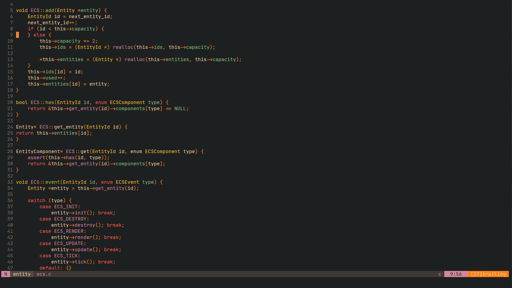
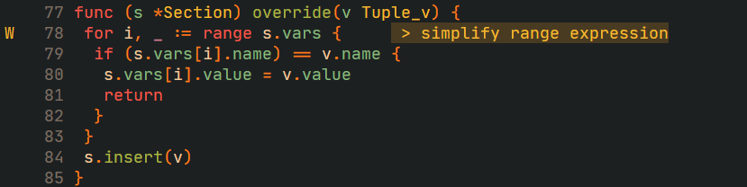
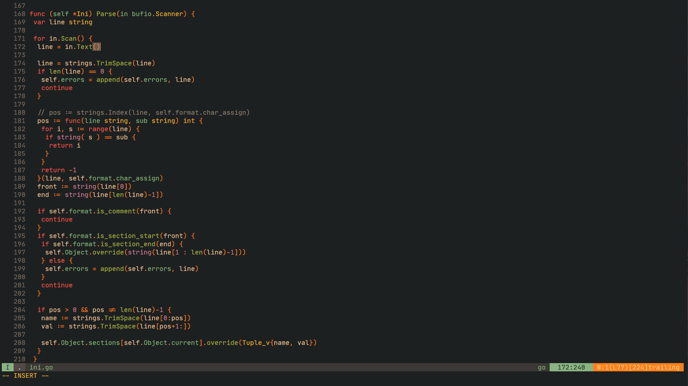

Gruvboxed is a colorscheme based on the original [gruvbox colorscheme](https://github.com/morhetz/gruvbox) by [morhetz](https://github.com/morhetz).

Designed as a cozy theme with pastel 'retro groove' colors, the main focus when developing gruvbox is to keep colors easily distinguishable, contrast enough and still pleasant for the eyes.

## Screenshots

<!-- Refer [Gallery][] for more syntax-specific screenshots.

   [Gallery]: https://github.com/morhetz/gruvbox/wiki/Gallery -->

### LSP Diagnostics

### Treesitter highlighting

<!-- ### Dark mode

### Light mode

 -->

### Airline theme

## Palette

<!--
### Dark mode -->

<!--
### Light mode

 -->

## Contrast options

<!-- Refer [wiki section][] for contrast configuration and other options.

   [wiki section]: https://github.com/morhetz/gruvbox/wiki/Configuration#ggruvbox_contrast_dark -->

<!-- ## Documentation

Please check [wiki][] for installation details, terminal-specific setup, troubleshooting, configuration options and others.

   [wiki]: https://github.com/morhetz/gruvbox/wiki -->

## Features

- Lots of style-customization options (contrast, color invertion, italics usage etc.)
- Extended filetype highlighting: Html, Xml, Vim, Clojure, C, Python, JavaScript, TypeScript, PureScript, CoffeeScript, Ruby, Objective-C, Go, Lua, MoonScript, Java, Markdown, Haskell, Elixir
- Support for Treesitter highlighting.
- Support for transparent background.
- Supported plugins: [EasyMotion][], [vim-sneak][], [Indent Guides][], [indentLine][], [Rainbow Parentheses][], [Airline][], [Lightline][], [GitGutter][], [Signify][], [ShowMarks][], [Signature][], [Syntastic][], [Ale][], [CtrlP][], [Startify][], [NERDTree][], [Dirvish][]

  [easymotion]: https://github.com/Lokaltog/vim-easymotion
  [vim-sneak]: https://github.com/justinmk/vim-sneak
  [indent guides]: https://github.com/nathanaelkane/vim-indent-guides
  [indentline]: https://github.com/Yggdroot/indentLine
  [rainbow parentheses]: https://github.com/kien/rainbow_parentheses.vim
  [airline]: https://github.com/bling/vim-airline
  [lightline]: https://github.com/itchyny/lightline.vim
  [gitgutter]: https://github.com/airblade/vim-gitgutter
  [signify]: https://github.com/mhinz/vim-signify
  [showmarks]: http://www.vim.org/scripts/script.php?script_id=152
  [signature]: https://github.com/kshenoy/vim-signature
  [syntastic]: https://github.com/scrooloose/syntastic
  [ale]: https://github.com/w0rp/ale
  [ctrlp]: https://github.com/kien/ctrlp.vim
  [startify]: https://github.com/mhinz/vim-startify
  [nerdtree]: https://github.com/scrooloose/nerdtree
  [dirvish]: https://github.com/justinmk/vim-dirvish

## Contributions

See [gruvbox-contrib](https://github.com/morhetz/gruvbox-contrib) repo for contributions, ports and extras for the original gruvbox colorscheme.

# Todo

- readme: update list of plugins and filetypes.
- wiki: add documentation for configuration

## License

[MIT/X11](https://en.wikipedia.org/wiki/MIT_License)
